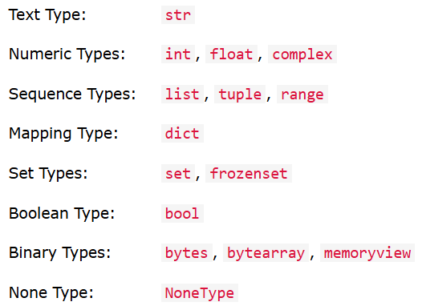

# Day 6 - Variables and Data Types
## What is a variable?
Variable is like a container that holds data. Very similar to how our containers in kitchen holds sugar, salt etc
Creating a variable is like creating a placeholder in memory and assigning it some value. In Python its as easy as writing:
```python
a = 1
b = True
c = "Harry"
d = None
```

These are four variables of different data types.

## What is a Data Type?
Data type specifies the type of value a variable holds. This is required in programming to do various operations without causing an error. \
In python, we can print the type of any operator using type function:
```python
a = 1
print(type(a))
b = "1"
print(type(b))
```
By default, python provides the following built-in data types:

## 1. Numeric data: int, float, complex


 - int: 3, -8, 0
 -    float: 7.349, -9.0, 0.0000001
 -  complex: 6 + 2i 

 ## 2. Text data: str
    

str: "Hello World!!!", "Python Programming"

## 3. Boolean data:
    

Boolean data consists of values True or False.

## 4. Sequenced data: list, tuple
    

**list:**  A list is an ordered collection of data with elements separated by a comma and enclosed within square brackets. Lists are mutable and can be modified after creation.

**Example:**

```python
list1 = [8, 2.3, [-4, 5], ["apple", "banana"]]
print(list1)
```


Output:

```markup
[8, 2.3, [-4, 5], ['apple', 'banana']]
```


**Tuple:**  A tuple is an ordered collection of data with elements separated by a comma and enclosed within parentheses. Tuples are immutable and can not be modified after creation. 

**Example:**

```python
tuple1 = (("parrot", "sparrow"), ("Lion", "Tiger"))
print(tuple1)
```


Output:

```python
(('parrot', 'sparrow'), ('Lion', 'Tiger'))
```


## 5. Mapped data: dict
    

**dict:** A dictionary is an unordered collection of data containing a key:value pair. The key:value pairs are enclosed within curly brackets.

**Example:**

```python
dict1 = {"name":"Sakshi", "age":20, "canVote":True}
print(dict1)
```


Output:

```python
{'name': 'Sakshi', 'age': 20, 'canVote': True}
```

